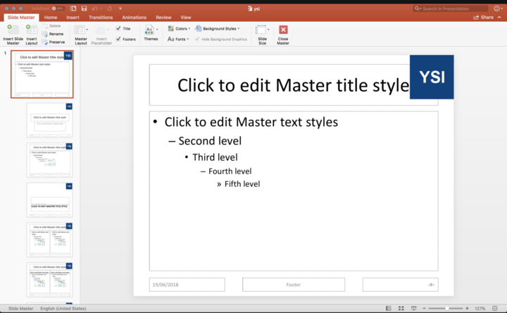
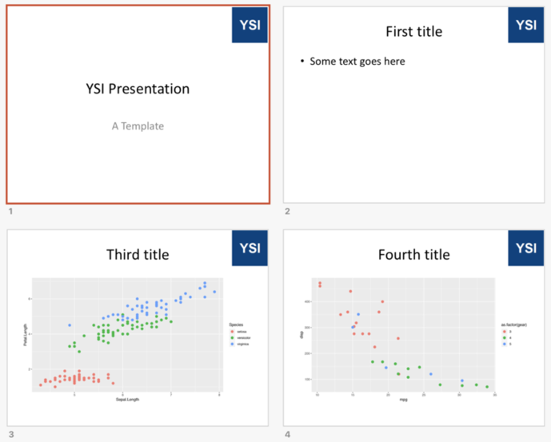

```{r setup, include=FALSE}
options(htmltools.dir.version = FALSE)

library(tidyverse)
```
class: inverse

# Contents

- Using the `officer` package
- Adding slides, text and plots
- Writing the pres to file


---

class: inverse

# The `officer` package

>The officer package lets R users manipulate Word (.docx) and PowerPoint (*.pptx) documents. In short, one can add images, tables and text into documents from R. An initial document can be provided; contents, styles and properties of the original document will then be available.

```{r, eval=F}
devtools::install_github("davidgohel/officer")
```


```{r}
library(tidyverse)
library(officer)
```

.footnote[https://davidgohel.github.io/officer/]

---
class: inverse

# A starter file
I've created a `.pptx` file that has a master slide with the ysi logo in the top right hand corner. (Can be modified)



---

class: inverse

## Reading the starter file

```{r}
p  <- read_pptx("docs/ysi.pptx")
```

## Add Title slide text

```{r}
p  <- p %>%
  on_slide(index = 1) %>%
  ph_with_text(type = "ctrTitle", str = "YSI Presentation") %>%
  ph_with_text(type = "subTitle", str = "A Template")
```

.footnote[`ph` stands for *place holder* (so its adding text to a place holder)]
---

class: inverse

## Add three blank slides

```{r}

for (n in seq(3)) {
  p <- p %>% 
  add_slide(layout = "Title and Content",
            master = "Office Theme")
}

```

## Add some text on slide 2

```{r}
p <- p %>% 
  on_slide(index = 2) %>%
  ph_with_text(type = "title", str = "First title") %>%
  ph_with_text(type = "body", str = "Some text goes here")
```

.footnote[Notice the `type` argument, this refers to the part of the slide to adjust]

---

class: inverse


## Add some plots

```{r}
pl1 <- ggplot(data = iris) +
    geom_point(mapping = aes(Sepal.Length, Petal.Length, col = Species), size = 3)

pl2 <- ggplot(data = mtcars) +
    geom_point(mapping = aes(mpg, disp, col = as.factor(gear)), size = 3)

```

# Add them to slides 3 & 4

```{r}
p <- p  %>%
  on_slide(index = 3) %>%
  ph_with_text(type = "title", str = "Third title") %>%
  ph_with_gg(value = pl1) %>%
  on_slide(index = 4) %>%
  ph_with_text(type = "title", str = "Fourth title") %>%
  ph_with_gg(value = pl2)
```

---

class: inverse

# Final write the slides to file

```{r}
print(p, target = "docs/test.pptx")
```

---

class: inverse

# Voila



